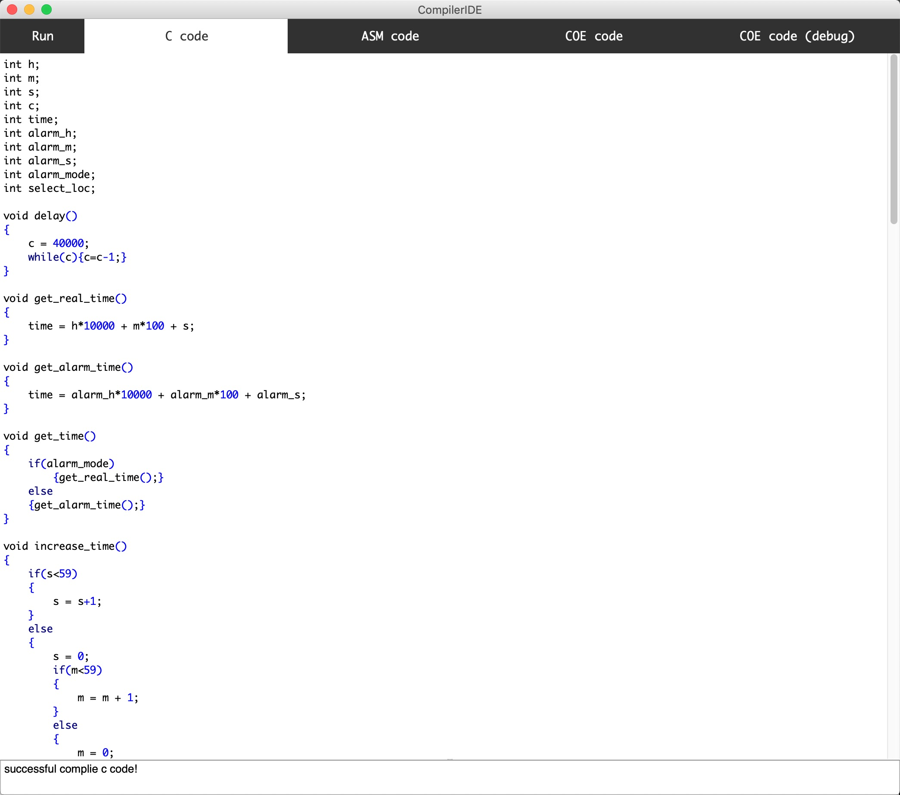
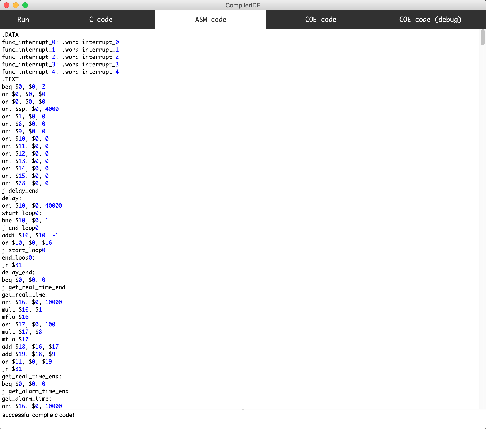
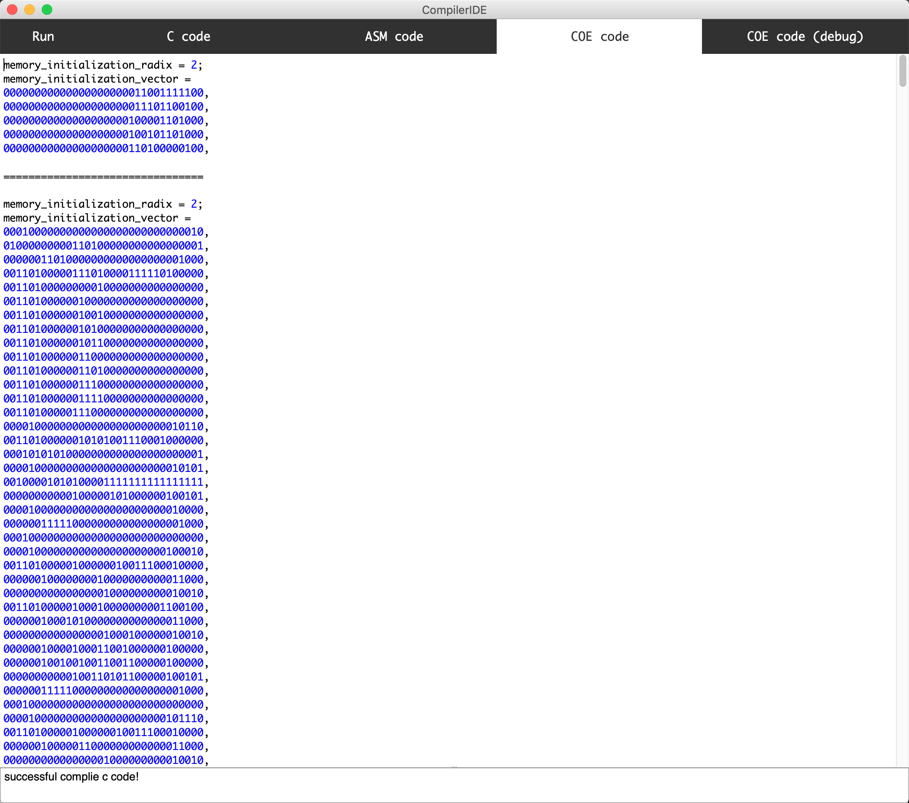
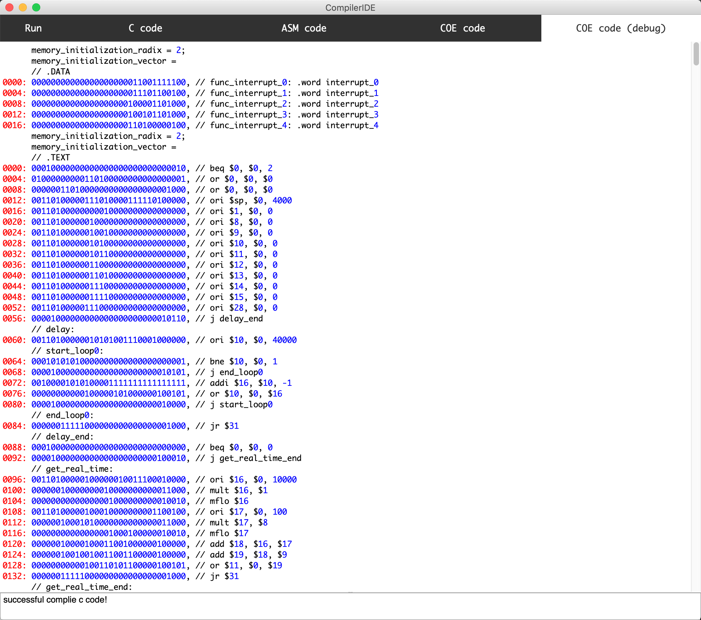

# Compiler++ IDE

### WHy use Compiler++ IDE?
* cool
* support mips with 57 instructions
* compile code from C, asm to coe code
* has amazing debug model which can show all code in the same window.

### Environment
* python 2.7.x
* PyQt4
* lex && yacc

### Start
run `sublime.py` and enjoy it.

### Demo
Input C code:

Compile asm code from C code:

Compile coe code from asm code:

debug model:
